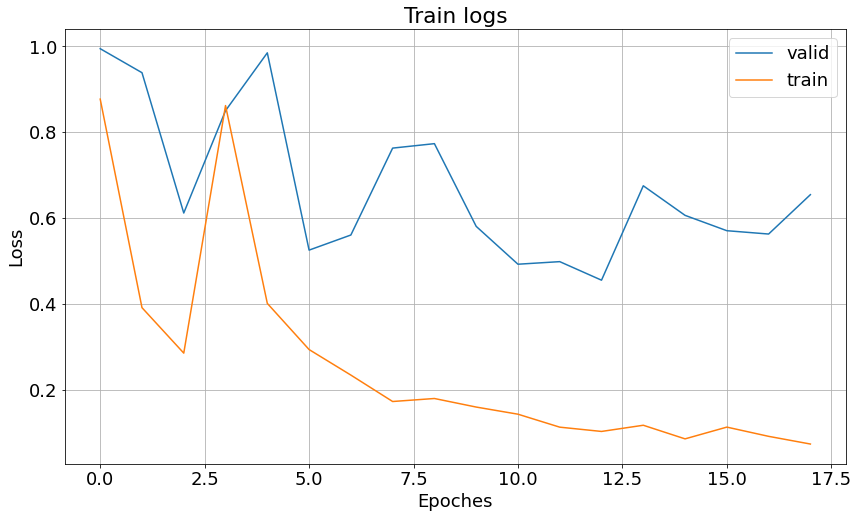
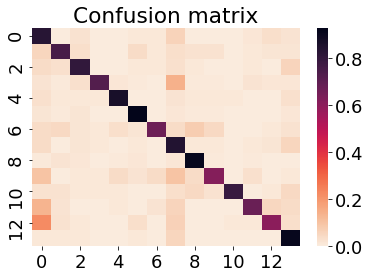

## Тестовое задание на позицию Computer Vision Engineer в OSAI

Для того, чтобы проверить решение, необходимо выполнить команды:

1)
```
sudo docker/build.sh
```
2.0)
```
sudo docker/run.sh
```
или 2.1)
```
sudo docker/run_volume.sh
```
(В случае 2.1 надо будет изменить \<ABSOLUTE_PATH\> на путь, где лежит папка с загруженными картинками)

После этого запустится контейнер, в котором все работает)

#### Загрузка изображений

Для начала загрузки изображений, необходимо выполнить:
```
python utils/download_data.py
```
Все битые ссылки будут проигнорированы, оставшиеся загрузятся в папку <b>data/images</b>. После этого пройдет проверка всех файлов на то, что это изображение и, если какие-то файлы окажутся чем-то иным, то они удалятся. 

Процесс загрузки досаточно долгий, поэтому для удобства выкладываю результат, чтобы его можно было подсунуть в папку: https://disk.yandex.ru/d/yWjEBAhodVlImg

Архив необходимо разархивировать и положить в <b>data</b>.
Тогда, запуская <b>docker/run_volume.sh</b>, создастся вольюм с этими фотками.

#### Обучение сети

Для обучения сети используется фреймворк Catalyst.

Все конфиги находятся в файле <b>configs/config.yaml</b>

Трейновые данные разделил на трейн и валидацию в пропорциях 0.85:0.15.

Лосс - <b>CrossEntropy</b>.

Было обучено 2 сети: resnet18 и mobilenet_v3_small, но resnet не взлетел вообще. Для выбора, какую именно сетку обучать, в конфиге необходимо поменять параметры модели, а именно поставить arch='resnet'

Процесс обучения тоже небыстрый, поэтому финальную модельку я сразу закинул в <b>weights/mobilenet_v3_small.py<>

График обучения:




#### Метрики

Для запуска теста необходимо выполнить: 
```
python utils/inference.py
```
Для обученной мной модели получилось:

F1_macro = <b>0.787</b>
Accuracy = <b>0.789</b>,

Если сравнить с результатами, которые были бы предсказаны просто взвешенным рандомом (вероятность_выбора_каждого_класса = доля_класса_в_выборке), то увидим, что рандом дал:

F1_macro = <b>0.07</b>
Accuracy = <b>0.07</b>,

что говорит нам о том, что простейшая модель работает значительно лучше :)

Также прикрепляю confusion matrix для оценки перепутывания классов:




